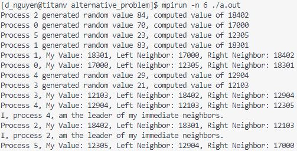

# Parallel Ring Leader Election *(alternative problem)*
Project 1 of California State University, Fullerton’s, CPSC-479 High Performance Computing, named *Introduction to HPC – Variant of Leader Election on a Ring Topology*, nicknamed by David Nguyen, *Parallel Ring Leader Election*.

***This is the alternative extra credit problem***

Project goal is to implement an algorithm to select a leader on a ring topology based on processes’ exclusive randomly generated computed value compared to it's neighbors' values. Using MPI (Message Passing Interface), randomly generating values and neighbor comparisons can be done in parallel to speed up the processing.

This project showcases one of many tasks that can be achieved using Message Passing Interface to speed up minor tasks and remove overheads that would normally appear in sequential processing.

Group Members:
- David Nguyen d_nguyen@csu.fullerton.edu / david@knytes.com / [@david-kishi](www.github.com/david-kishi)

## Getting Started

### Prerequisites
- System with MPI installed
    - CSUF students/faculty ssh into titan-v
- or MPI Docker (https://hub.docker.com/r/nlknguyen/alpine-mpich/)

### To run program:
1. In terminal, change to directory with file ring_election.c.
2. Run `mpicc ring_election_alt.c` to build the program.
3. Run `mpirun -n <# of processes wished> ./a.out` to run program
    - Number of processes must be between [6, 20]
    - a.out is the default compiled name. If you named the compiled name differently,
replace a.out with that name.
4. Success!

## Example outputs
